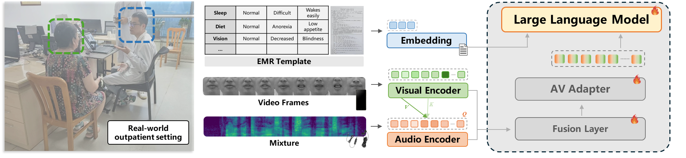

# EMR-LLM-CN

EMR-LLM-CN 是一个基于 **Qwen2.5-3B-Instruct** 的大语言模型（LLM），能够处理**多模态对话输入**，并将其总结为**结构化、基于标签的电子病历（EMR）**，同时支持**视听语音识别**和**电子病历标签生成**。

代码受版权保护，使用时请**注明来源**，**禁止任何侵权行为**。



## 环境配置

```bash

conda create -n emr python=3.9 -y
conda activate emr
git clone https://github.com/Shuaque/EMR-LLM-CN.git
cd EMR-LLM-CN

# PyTorch and related packages
pip install -U "pip<24.1" "setuptools<72" #(If your pip version > 24.1, please run this)
pip install "PyYAML>=5.1" "omegaconf==2.0.6" "hydra-core==1.0.7"


cd fairseq
pip install --editable ./

pip install torch==2.1.2 torchvision==0.16.2 torchaudio==2.1.2 --index-url https://download.pytorch.org/whl/cu121
pip install numpy==1.23.5 scipy opencv-python
pip install editdistance python_speech_features einops soundfile sentencepiece tqdm tensorboard unidecode librosa
pip install omegaconf==2.0.6 hydra-core==1.0.7 #(If your pip version > 24.1, please run "python3 -m pip install --upgrade pip==24.0")
pip install transformers==4.47.1 peft==0.14.0
pip install bitsandbytes --prefer-binary
pip install tensorboardX av matplotlib scikit-image

```

* 在 `../../EMR-LLM-CN/data/preparation/detectors/retinaface` 目录下安装 `retinaface` 检测器，你也可以在 `../detectors` 中放置其他检测器：

```bash
cd ../data/preparation/detectors/retinaface/
# Install [ibug.face_detection](https://github.com/hhj1897/face_detection)


git clone https://github.com/hhj1897/face_detection.git

# if its exisct in dir, than:
cd face_detection
pip install -e .
cd ..
```

* 建议：由于 `ibug/face_detection/retina_face/weights/Resnet50_Final.pth` 经常下载出错，推荐手动下载并放置到指定目录。

```bash
Install [*`ibug.face_alignment`*](https://github.com/hhj1897/face_alignment)

git clone https://github.com/hhj1897/face_alignment.git

# if its exisct in dir, than:
cd face_alignment
pip install -e .
cd ..
```

* 从以下链接下载 `Reference mean face`，并同样放置到 `../detectors` 目录中：[Link](https://github.com/mpc001/Lipreading_using_Temporal_Convolutional_Networks/blob/master/preprocessing/20words_mean_face.npy)

## 下载

1. 下载下方由 AI 生成的多模态（视听）EMR 数据集，并放置到 `../../EMR-LLM-CN/data` 中
2. 下载 `AVSR` 与 `EMR` 任务对应的模型 checkpoint，并放置到 `../../EMR-LLM-CN/pretrianed` 中
3. 下载 `avhubert` checkpoint，并放置到 `../../EMR-LLM-CN/pretrained/Avhubert/base_vox_iter5.pt`
4. 从 HuggingFace 或 ModelScope 平台下载 `whisper`，并放置到 `../../EMR-LLM-CN/pretrained/Whisper/whisper-large`
5. 从 HuggingFace 或 ModelScope 平台下载 `Qwen2.5-3B-Instruct`，并放置到 `../../EMR-LLM-CN/pretrained/LLM/Qwen2.5-3B-Instruct`

| File Name               | Source URL                                                                                                                                                                      | File Size |
| ----------------------- | ------------------------------------------------------------------------------------------------------------------------------------------------------------------------------- | --------- |
| CMDD-MIE-EMR-AV         | [GoogleDrive](https://drive.google.com/drive/folders/1XjJ0T5kQ-ntyWc_2M1EHZJxpba1c9FId?usp=sharing) or [BaiduDrive](https://pan.baidu.com/s/1FI7JZw8aSFEoO13X405SBg)(key: cize) | 18GB      |
| emr_checkpoint_best.pt  | [GoogleDrive]() or [BaiduDrive]()(key: )                                                                                                                                        | 8.3GB     |
| avsr_checkpoint_best.pt | [GoogleDrive]() or [BaiduDrive]()(key: )                                                                                                                                        | 14.3GB    |

由于超参数优化，部分结果略优于论文中的结果。AV-ASR 相关代码与 checkpoint 可在发布版本中获取。

## 推理

运行脚本 `../../EMR-LLM-CN/inference.py` 以进行**单样本评估**。脚本内置了评估示例，支持在 **纯文本**、**音视频** 和 **仅音频** 等多种模态的 EMR 数据上进行评估。多模态数据示例可在 `../../EMR-LLM-CN/data/examples` 中找到，其中提供了可用于评估的音频或视频样本。

```bash

# 启动脚本 bash /../../EMR-LLM-CN/scripts/inference.sh

export ROOT=../../EMR-LLM-CN
export TOKENIZERS_PARALLELISM=false
export SRC_PTH="$ROOT/src"
export PYTHONPATH=$ROOT:$ROOT/fairseq:$SRC_PTH

CHECKPOINT=/workspace/shuaque/Classification_Semantic_att_LLM/exp/202512/run/28190745_A800_Optimized_Exp1_3_B_3_loss/checkpoints/checkpoint_best.pt

CUDA_VISIBLE_DEVICES=0 python $ROOT/inference.py \
    --common-user-dir /workspace/shuaque/EMR-LLM-CN/src \
    --checkpoint-path $CHECKPOINT \
    --ontology-path /workspace/shuaque/EMR-LLM-CN/data/ontology.json \
    --device cuda:0
```

示例结果可在 `../../EMR-LLM-CN/inference.log` 中查看。

```bash
| [Pipeline] Processing Dialogue Inputs...

============================================================
| Final Context for EMR Model:
============================================================
患者:没有呕吐,就是吐了点奶,
医生:宝宝今天吐奶几次
患者:一次
医生:血丝多吗
医生:呕吐物中有粘液吗?
============================================================

| [EMR] Running entity extraction...

[Top-10 Probabilities]
Rank  1 | Prob: 0.9934 | 症状:呕吐
Rank  2 | Prob: 0.7551 | 症状:大便粘液
Rank  3 | Prob: 0.3389 | 症状:血便
Rank  4 | Prob: 0.0722 | 症状:大便黏液
Rank  5 | Prob: 0.0541 | 症状:稀便
Rank  6 | Prob: 0.0226 | 症状:蛋花汤样便
Rank  7 | Prob: 0.0169 | 症状:退热
Rank  8 | Prob: 0.0148 | 症状:咳痰
Rank  9 | Prob: 0.0145 | 症状:痰
Rank 10 | Prob: 0.0144 | 症状:咳嗽

------------------------------------------------------------
[Summary: Final Predicted Labels (Threshold > 0.5)]
 - 症状:大便粘液
 - 症状:呕吐
============================================================


| [Pipeline] Processing Dialogue Inputs...

============================================================
| Final Context for EMR Model:
============================================================
患者:心脏的血管堵塞有什么最新治疗方法吗
医生:您好,要看在什么部位,一般可以下支架解决堵塞问题!CT未看到堵塞,有肌桥,若症状较重考虑搭桥手术!
============================================================

| [EMR] Running entity extraction...

[Top-10 Probabilities]
Rank  1 | Prob: 1.0000 | 手术:支架
Rank  2 | Prob: 0.9998 | 手术:搭桥
Rank  3 | Prob: 0.9843 | 症状:心肌梗死
Rank  4 | Prob: 0.8889 | 症状:冠心病
Rank  5 | Prob: 0.3260 | 症状:胸闷
Rank  6 | Prob: 0.1104 | 症状:乏力
Rank  7 | Prob: 0.0650 | 症状:水肿
Rank  8 | Prob: 0.0535 | 症状:高血压
Rank  9 | Prob: 0.0409 | 症状:呼吸困难
Rank 10 | Prob: 0.0263 | 手术:介入

------------------------------------------------------------
[Summary: Final Predicted Labels (Threshold > 0.5)]
 - 症状:心肌梗死
 - 症状:冠心病
 - 手术:搭桥
 - 手术:支架
============================================================


| [Pipeline] Processing Dialogue Inputs...

============================================================
| Final Context for EMR Model:
============================================================
医生:在看化验单
医生:就这个大便结果来看,是病毒合并细菌感染,这两个药可以继续吃,孩子大便还是不见好吗?
患者:是的
患者:还要给他添点别的药吗?昨天好一点,今天又开始了
医生:大便是什么样子?能拍个图片吗?
============================================================

| [EMR] Running entity extraction...

[Top-10 Probabilities]
Rank  1 | Prob: 0.9270 | 症状:细菌感染
Rank  2 | Prob: 0.6570 | 症状:病毒感染
Rank  3 | Prob: 0.0319 | 症状:退热
Rank  4 | Prob: 0.0226 | 症状:腹泻
Rank  5 | Prob: 0.0183 | 症状:痢疾
Rank  6 | Prob: 0.0175 | 症状:病毒性肠炎
Rank  7 | Prob: 0.0155 | 症状:轮状病毒感染
Rank  8 | Prob: 0.0152 | 症状:细菌性肠炎
Rank  9 | Prob: 0.0146 | 症状:大便粘液
Rank 10 | Prob: 0.0144 | 症状:细菌性感冒

------------------------------------------------------------
[Summary: Final Predicted Labels (Threshold > 0.5)]
 - 症状:细菌感染
 - 症状:病毒感染
============================================================


| [Pipeline] Processing Dialogue Inputs...

============================================================
| Final Context for EMR Model:
============================================================
医生:你好,有具体彩超单子吗?
患者:有,刚满月拍的彩超。现在孩子三个月了
医生:拍一个完整的
患者:
医生:孩子现在有什么症状吗?
============================================================

| [EMR] Running entity extraction...

[Top-10 Probabilities]
Rank  1 | Prob: 1.0000 | 检查:彩超
Rank  2 | Prob: 0.0486 | 检查:b超
Rank  3 | Prob: 0.0264 | 检查:超声
Rank  4 | Prob: 0.0239 | 检查:体检
Rank  5 | Prob: 0.0111 | 症状:先天性心脏病
Rank  6 | Prob: 0.0102 | 检查:血常规
Rank  7 | Prob: 0.0098 | 症状:心律不齐
Rank  8 | Prob: 0.0090 | 症状:甲亢
Rank  9 | Prob: 0.0065 | 检查:心肌酶
Rank 10 | Prob: 0.0052 | 症状:发绀

------------------------------------------------------------
[Summary: Final Predicted Labels (Threshold > 0.5)]
 - 检查:彩超
============================================================

```

## EMR 数据的批量评估

请确保 `test.json` 保存在 `../data` 中，并且 `$CHECKPOINT` 已下载并放置在 `../../EMR-LLM-CN/pretrained` 目录下。`--ratios` 参数可在 `[0.1–1.0]` 范围内设置，用于减少候选标签数量，从而缩短评估时长。评估结果将保存在 `../../EMR-LLM-CN/results/` 中。评估脚本位于 `../../EMR-LLM-CN/scritps/eval_emr.sh`，示例结果可在 `../../EMR-LLM-CN/results/emr_eval_sweep.log` 中查看。

```bash
export ROOT=../../EMR-LLM-CN
export TOKENIZERS_PARALLELISM=false
export SRC_PTH="$ROOT/src"
export PYTHONPATH=$ROOT:$ROOT/fairseq:$SRC_PTH

CHECKPOINT=../EMR-LLM-CN/pretrained/emr_checkpoint_best.pt

CUDA_VISIBLE_DEVICES=0 python3 $SRC_PTH/eval.py \
    --common-user-dir $SRC_PTH \
    --checkpoint-path $CHECKPOINT \
    --split test \
    --device cuda:0 \
    --output-dir $ROOT \
    --ratios 1.0
```

## 视听数据的批量评估

请将音视频路径文件 `test.tsv` 及对应的文本标签文件 `test.ltr` 存放在 `$DATA` 中。音视频路径文件应包含 `id, role, video_path, audio_path, video_frames, audio_frames`，标签文件应包含 `id, role, text`。或者修改数据集类 `../../EMR-LLM-CN/scr_avsr/dataset.py`。更多细节请参考下方 **Train for Audio-Visual Speech Recognotion** 部分。示例结果可在 `../../EMR-LLM-CN/results/avsr_eval_log.txt` 中查看。

```bash
#! /bin/bash

export ROOT=../../EMR-LLM-CN
export SRC_PTH=$ROOT/src_avsr
export PYTHONPATH=$ROOT:$ROOT/fairseq:$SRC_PTH

LLM_PATH=$ROOT/pretrained/LLM/Qwen2.5-3B-Instruct
Whisper_PATH=$ROOT/pretrained/Whisper/whisper-large
Avhubert_PATH=$ROOT/pretrained/Avhubert/base_vox_iter5.pt
CTC_VOCAB=$ROOT/data/global_ctc_vocab_3bi.pt

DATA=../CMDD-MIE-EMR-AV

# Fine-tuned model path (Checkpoint)
MODEL_PATH=$ROOT/exp/202601/run/train_21_214647/checkpoints/checkpoint_best.pt
OUT_PATH=$ROOT/results/

CUDA_VISIBLE_DEVICES=0 python -B $SRC_PTH/eval.py \
  --config-dir ${SRC_PTH}/conf \
  --config-name eval \
  common.user_dir=${SRC_PTH} \
  common_eval.path=${MODEL_PATH} \
  common_eval.results_path=${OUT_PATH} \
  dataset.gen_subset=test \
  model.w2v_path=${Avhubert_PATH} \
  model.whisper_path=${Whisper_PATH} \
  model.ctc_vocab_path=${CTC_VOCAB} \
  override.llm_path=${LLM_PATH} \
  override.data=${DATA} \
  override.label_dir=${DATA} \
  override.modalities="['audio','video']" \
  override.noise_wav=${ROOT}/data/babble_noise.wav \
  override.noise_prob=0.0 \
  override.noise_snr=0
```

## EMR 生成任务训练

请确保 **纯文本 EMR 数据集** 保存在 `../data/test.json | train.json | dev.json` 中，**训练脚本** 位于 `../../EMR-LLM-CN/scirpts/train_emr.sh`，可在 `../../EMR-LLM-CN/src/conf/train.yaml` 中修改参数配置，**训练日志** 将保存在 `../../EMR-LLM-CN/exp` 中。

```bash
# #!/usr/bin/env bash
# set -euo pipefail

export ROOT=../../EMR-LLM-CN
export TOKENIZERS_PARALLELISM=false
export SRC_PTH="$ROOT/src"
export CONF_DIR="$SRC_PTH/conf"
export CONF_NAME="train.yaml"

export PYTHONPATH="$ROOT/fairseq"
export CUDA_VISIBLE_DEVICES=0,1,2,3
NGPUS=4

fairseq-hydra-train \
  --config-dir "$CONF_DIR" \
  --config-name "$CONF_NAME" \
  common.user_dir="$SRC_PTH" \
  distributed_training.distributed_world_size=$NGPUS

```

## 视听语音识别训练

请确保 **视听数据集** 保存在 `../data/test.tsv | train.tsv | valid.tsv` 中，每条记录格式为 `id, role, video_path, audio_path, video_frames, audio_frames`，对应的 **文本标签** 保存在 `../data/test.ltr | train.ltr | valid.ltr` 中，格式为 `id, role, text`，例如：

```bash

# train.tsv
cmdd_dia_78_win_5            pat     ../../train/video96/cmdd_dia_78_win_5.mp4        ../../train/audio16k/cmdd_dia_78_win_5.wav        37      23680
S0116_M-0116-1_014176-014616 NA      ../../train/video/S0116_M-0116-1_014176-014616.mp4 /wav16k/S0116/S0116_M-0116-1_014176-014616.wav      110     70400
cmdd_dia_377_win_30          pat     ../../train/video96/cmdd_dia_377_win_30.mp4        ../../train/audio16k/cmdd_dia_377_win_30.wav        38      24320

# train.ltr
cmdd_dia_78_win_5            pat     精神都很好
S0116_M-0116-1_014176-014616 unknown 阳光下万物生长生命在这土地上蓬勃
cmdd_dia_377_win_30          pat     她咳了都一个星期了

```

**训练脚本** 位于 `../../EMR-LLM-CN/scirpts/train_avsr.sh`，参数配置可在 `../../EMR-LLM-CN/src_avsr/conf/train_avsr.yaml` 中修改，**训练日志** 将保存在 `../../EMR-LLM-CN/exp` 中。

```bash
#!/usr/bin/env bash
set -euo pipefail

export ROOT=../../EMR-LLM-CN
SRC_PTH="$ROOT/src_avsr"
CONF_DIR="$SRC_PTH/conf"
CONF_NAME="train_avsr"
export TOKENIZERS_PARALLELISM=false
export PYTHONPATH="$ROOT/fairseq"

export LD_LIBRARY_PATH=$LD_LIBRARY_PATH:/usr/local/cuda/lib64
NGPUS=4

CUDA_VISIBLE_DEVICES=0,1,2,3 fairseq-hydra-train \
  --config-dir "$CONF_DIR" \
  --config-name "$CONF_NAME" \
  common.user_dir="$SRC_PTH" \
  distributed_training.distributed_world_size="$NGPUS" \
  distributed_training.nprocs_per_node="$NGPUS"
```
